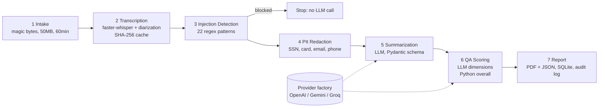

# Pipeline diagram

Stages run in this order. No LLM is called before stage 4 completes.

```mermaid
flowchart LR
    A[1 Intake<br/>magic bytes, 50MB, 60min] --> B[2 Transcription<br/>faster-whisper + diarization<br/>SHA-256 cache]
    B --> C[3 Injection Detection<br/>22 regex patterns]
    C -->|blocked| X[Stop: no LLM call]
    C --> D[4 PII Redaction<br/>SSN, card, email, phone]
    D --> E[5 Summarization<br/>LLM, Pydantic schema]
    E --> F[6 QA Scoring<br/>LLM dimensions<br/>Python overall]
    F --> G[7 Report<br/>PDF + JSON, SQLite, audit log]
    LLM[(Provider factory<br/>OpenAI / Gemini / Groq)] -.-> E
    LLM -.-> F
```
